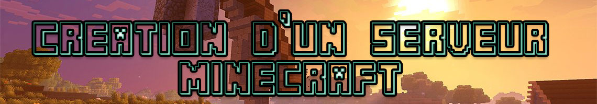

## Intro

​	Ceci est un projet de création du serveur Minecraft en mode créatif, les ressources citées sont celles qu'ont glanées au fur et mesure des différents live sur le stream, elles ne donc pas un axe a suivre au pied de la lettre, il s'agit plus d'un guide et un Knowledge pour partir de zéro sans connaissances. 

## Infrastructure: 

​	​	Pour notre besoin on est partie sur un serveur hébergé dont voici les différents prérequis qu'on a pris pour la version dev 	

### 	**OS :**  Ubuntu 

### 	**Matériels :** 

- Processeur: x86
- Ram : 10go
- HDD : 100GB 

### **Programmes et Langages requis sur le serveur :** 

- Tmux 
- Nodejs 
- Java Headless
- GIT 
- VIM 

## Ressources: 

​	***Serveur (Jeu):*** 

​		***Développement du serveur :*** 

​			Coté serveur nous avons opté pour un manager de serveur Minecraft appelé **[MineOS](https://minecraft.codeemo.com/)**, avec le guide d'installation par [défaut pour ubuntu](https://minecraft.codeemo.com/mineoswiki/index.php?title=MineOS-node_(apt-get)), utilisation de [Paper](https://papermc.io/)

​	***Client (Jeu) :*** 

### **Minecraft Launcher :** 

- [Optifine](https://optifine.net/downloads) 
- vanilla
- [Sodium](https://www.curseforge.com/minecraft/mc-mods/sodium) 

### **Mods et Plugins :** 

- [WordEdit FastAsync](https://intellectualsites.github.io/download/fawe.html) 
- [Via Version](https://docs.viaversion.com/display/VIAVERSION/Installation)
- [Chisel and Bit](https://www.curseforge.com/minecraft/mc-mods/chisels-bits) 

### Commandes importantes : 

**/op** : https://fr-minecraft.net/commande-op.html

**/gamemode** : https://fr-minecraft.net/commande-gamemode-cmd.html

**/weather** : https://minecraft.gamepedia.com/Commands/weather

**/time** : https://minecraft-fr.gamepedia.com/Cycle_jour-nuit

**Commande block** : https://minecraft-fr.gamepedia.com/Bloc_de_commande

**Logiciels :** 

[WorldPainter](https://www.worldpainter.net/)
[Chunky](http://chunky.llbit.se/index.html) 
[GAEA](www.quadspinner.com/GeoGlyph)
[Builder's utility](https://www.spigotmc.org/resources/builders-utilities.42361/)
[WaterFall](https://github.com/PaperMC/Waterfall/releases/tag/downloads) 

### Liens Utiles : 

[Minecraft Schematics](https://www.minecraft-schematics.com/)
[Athion](https://athion.net/fawe/)
[GrabCraft](https://www.grabcraft.com/) 
[Firewall Guide](https://www.spigotmc.org/wiki/firewall-guide/)

